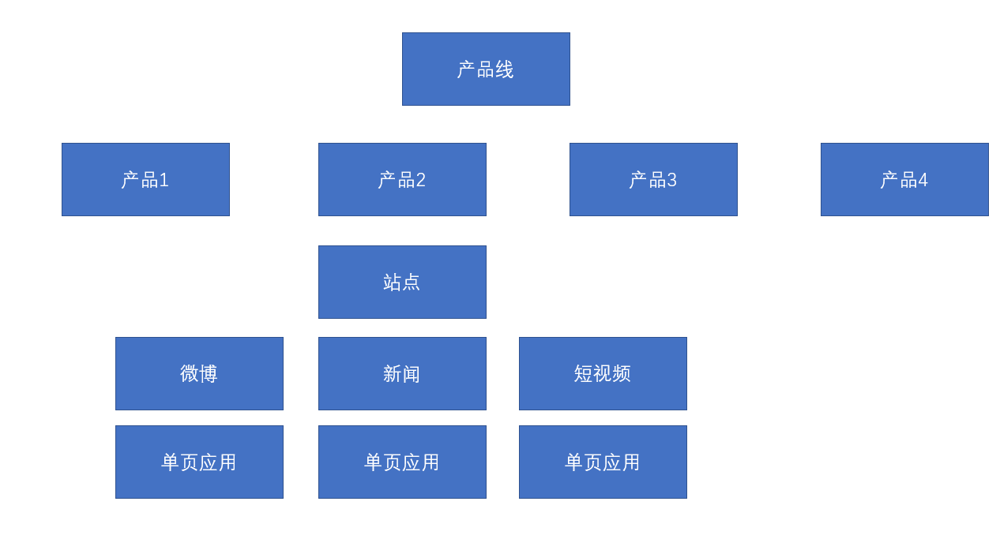

# React Router 概述

React路由

## 站点

无论是使用Vue，还是React，开发的单页应用程序，可能只是该站点的一部分（某一个功能块）

一个单页应用里，可能会划分为多个页面（几乎完全不同的页面效果）（组件）

如果要在单页应用中完成组件的切换，需要实现下面两个功能：

1. 根据不同的页面地址，展示不同的组件（核心）
2. 完成无刷新的地址切换

我们把实现了以上两个功能的插件，称之为路由

## React Router

1. react-router：路由核心库，包含诸多和路由功能相关的核心代码
2. react-router-dom：利用路由核心库，结合实际的页面，实现跟页面路由密切相关的功能

如果是在页面中实现路由，需要安装react-router-dom库