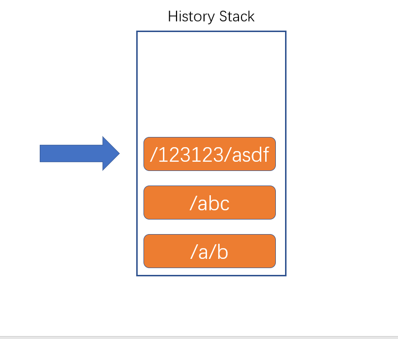

# 两种模式

路由：根据不同的页面地址，展示不同的组件

url地址组成

例：https://www.react.com:443/news/1-2-1.html?a=1&b=2#abcdefg

1. 协议名(schema)：https
2. 主机名(host)：www.react.com
   1. ip地址
   2. 预设值：localhost
   3. 域名
   4. 局域网中电脑名称
3. 端口号(port)：443
   1. 如果协议是http，端口号是80，则可以省略端口号
   2. 如果协议是https，端口号是443，则可以省略端口号
4. 路径(path)：/news/1-2-1.html
5. 地址参数(search、query)：?a=1&b=2
   1. 附带的数据
   2. 格式：属性名=属性值&属性名=属性值....
6. 哈希(hash、锚点)
   1. 附带的数据

## Hash Router 哈希路由

根据url地址中的哈希值来确定显示的组件

> 原因：hash的变化，不会导致页面刷新
> 这种模式的兼容性最好

## Borswer History Router 浏览器历史记录路由

HTML5出现后，新增了History Api，从此以后，浏览器拥有了改变路径而不刷新页面的方式

History表示浏览器的历史记录，它使用栈的方式存储。

1. history.length：获取栈中数据量
2. history.pushState：向当前历史记录栈中加入一条新的记录
   1. 参数1：附加的数据，自定义的数据，可以是任何类型
   2. 参数2：页面标题，目前大部分浏览器不支持
   3. 参数3：新的地址
3. history.replaceState：将当前指针指向的历史记录，替换为某个记录
   1. 参数1：附加的数据，自定义的数据，可以是任何类型
   2. 参数2：页面标题，目前大部分浏览器不支持
   3. 参数3：新的地址

根据页面的路径决定渲染哪个组件